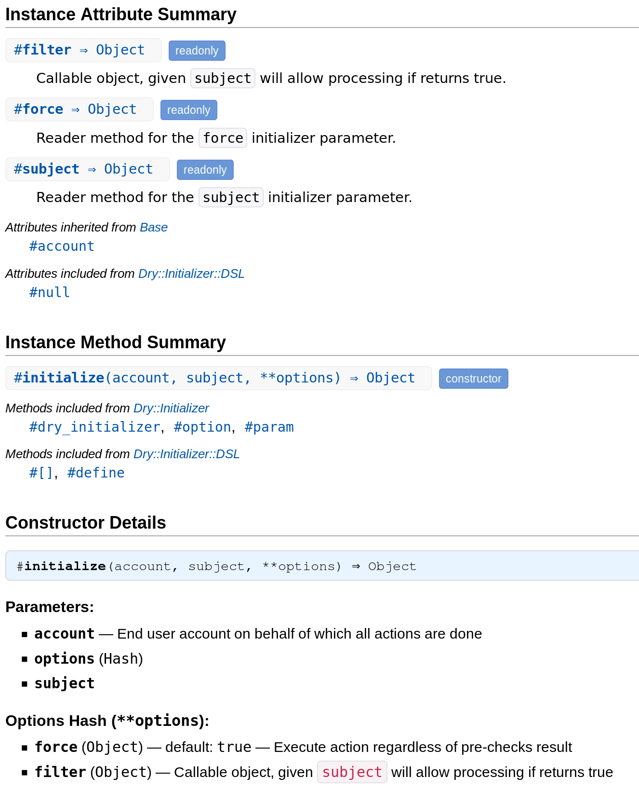

# YARD plugin for Dry::Initializer

The [dry-initializer] gem is awesome. It makes defining dependencies of your classes so convenient and declarative.

But when you're using these classses, how to get know which positional arguments does it expect and in which order and which keyword ones?

It's easy (but bother) to look into source code, but in case of using inheritance it will be very cumbersome.

This YARD plugin to the rescue!

<a href="https://evilmartians.com/?utm_source=yard-dry-initializer&utm_campaign=project_page"></a>

Write this:

```
class Base
  extend Dry::Initializer

  param :account,                       comment: "End user account on behalf of which all actions are done"
  option :force, default: -> { false }, comment: "Execute action regardless of pre-checks result"
end

class ProcessSubject < Base
  param :subject
  option :filter, comment: "Callable object, given +subject+ will allow processing if returns true"
  option :force,  default: -> { true }
end
```

And you will get this:



## Installation

Add this line to your application's Gemfile:

```ruby
gem 'yard-dry-initializer'
```

And then execute:

    $ bundle

Add this line in your `.yardopts`:

    --plugin dry-initializer

## Usage

Use YARD as usual, enjoy new info in your docs.

If you're getting `[error]: Error loading plugin 'yard-dry-initializer'` error you may need to invoke `yard` via `bundle exec` or generate binstubs for it.

## Development

After checking out the repo, run `bin/setup` to install dependencies. Then, run `rake spec` to run the tests. You can also run `bin/console` for an interactive prompt that will allow you to experiment.

To install this gem onto your local machine, run `bundle exec rake install`. To release a new version, update the version number in `version.rb`, and then run `bundle exec rake release`, which will create a git tag for the version, push git commits and tags, and push the `.gem` file to [rubygems.org](https://rubygems.org).

## Contributing

Bug reports and pull requests are welcome on GitHub at https://github.com/Envek/yard-dry-initializer.

## License

The gem is available as open source under the terms of the [MIT License](https://opensource.org/licenses/MIT).
